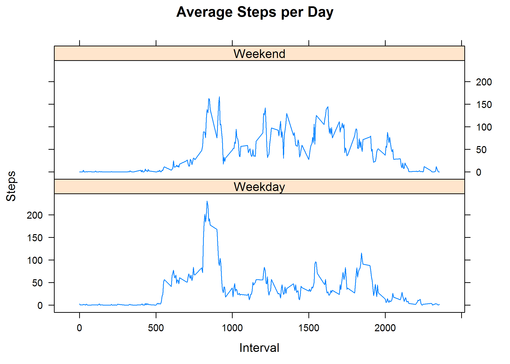

# Reproducible Research: Peer Assessment 1
Damon Resnick  
January 1, 2017  
<br>  

```r
library(knitr)
library(formatR)
library(lattice)
opts_chunk$set(tidy.opts=list(width.cutoff=80),tidy=TRUE)
opts_chunk$set(out.width='750px', dpi=300)
```


## Loading and preprocessing the data


```r
setwd("~/GitHub/RepData_PeerAssessment1")
df <- read.csv("./data/activity.csv")
```

<br>  


## What is mean total number of steps taken per day?


```r
# Use the aggregate function to create an object which computes the total number
# of steps for each day.
stepspday <- aggregate(steps ~ date, df, sum)
hist(stepspday$steps, breaks = 10, main = "Steps per Day", xlab = "Number of Steps", 
    ylab = "Days", col = "red")
```


```r
# Use the mean and median functions to find the mean and median of steps.
meanstepspday <- mean(stepspday$steps)
meanstepspday
```

```
## [1] 10766.19
```

```r
meadianstepspday <- median(stepspday$steps)
meadianstepspday
```

```
## [1] 10765
```

#### The mean number of steps per day is 10766 and the median number of steps per day is 10765.

<br>  


## What is the average daily activity pattern?

Time series plot (i.e. type = "l") of the 5-minute interval (x-axis) and the average number of steps taken, averaged across all days (y-axis)


```r
# Use the aggregate function to create an object which computes the average
# number of steps for each interval.
stepsinterval <- aggregate(steps ~ interval, df, mean)
plot(stepsinterval$interval, stepsinterval$steps, type = "l", main = "Average Number of Steps per Day", 
    xlab = "Interval", ylab = "Steps", col = "red")
```


<br>  


Which 5-minute interval, on average across all the days in the dataset, contains the maximum number of steps?


```r
maxsteps <- round(max(stepsinterval$steps))
maxinterval <- stepsinterval[which.max(stepsinterval$steps), 1]
```

#### The maximum number of steps in an interval is 206 and the interval which has the max number of steps is interval 835.

<br>  


## Imputing missing values

Note that there are a number of days/intervals where there are missing values (coded as NA). The presence of missing days may introduce bias into some calculations or summaries of the data.


```r
numbernas <- sum(is.na(df$steps))
```

#### All the NAs are in the steps column.  The total number of NAs is 2304.

<br>  


2) Devise a strategy for filling in all of the missing values in the dataset. The strategy does not need to be sophisticated. For example, you could use the mean/median for that day, or the mean for that 5-minute interval, etc.

3) Create a new dataset that is equal to the original dataset but with the missing data filled in.

```r
# Use the aggregate function to create an object which computes the median number
# of steps for each interval.
stepsintervalmedian <- aggregate(steps ~ interval, df, median)
# plot(stepsintervalmedian$interval, stepsintervalmedian$steps, type = 'l', main
# = 'Steps per Day', xlab = 'Interval', ylab = 'Steps', col = 'red')

# Use the match ifelse function to deterimine which ones to replace while using
# the match function to find what to replace the NAs with.
dfupdated <- transform(df, steps = ifelse(is.na(df$steps), stepsintervalmedian$steps[match(df$interval, 
    stepsintervalmedian$interval)], df$steps))
imputedf <- transform(df, steps = ifelse(is.na(df$steps), stepsinterval$steps[match(df$interval, 
    stepsinterval$interval)], df$steps))
```

#### NAs were replaced by the average number of steps for that interval.

<br>  


```r
# Use the mean and median functions to find the mean and median of steps.
updatedstepsday <- aggregate(steps ~ date, imputedf, sum)
meanstepspdayup <- mean(updatedstepsday$steps)
meanstepspdayup
```

```
## [1] 10766.19
```

```r
meadianstepspdayup <- median(updatedstepsday$steps)
meadianstepspdayup
```

```
## [1] 10766.19
```

#### The mean and median number of steps per day is 10766.19.


4) Make a histogram of the total number of steps taken each day and Calculate and report the mean and median total number of steps taken per day. Do these values differ from the estimates from the first part of the assignment? What is the impact of imputing missing data on the estimates of the total daily number of steps?

```r
hist(updatedstepsday$steps, breaks = 10, main = "Steps per Day", xlab = "Number of Steps", 
    ylab = "Days", col = "green")
# Histogram to show the difference.
hist(stepspday$steps, breaks = 10, main = "Steps per Day", xlab = "Number of Steps", 
    ylab = "Days", col = "red", add = T)
legend("topleft", c("Imputed", "Non-imputed"), col = c("green", "red"), lwd = 10)
```


#### Adding values for the NAs changes mainly the data in the middle of the day.  The total number of steps is larger with adding values for the NAs.


## Are there differences in activity patterns between weekdays and weekends?

For this part the weekdays() function may be of some help here. Use the dataset with the filled-in missing values for this part.

Create a new factor variable in the dataset with two levels -- "weekday" and "weekend" indicating whether a given date is a weekday or weekend day.

Make a panel plot containing a time series plot (i.e. type = "l") of the 5-minute interval (x-axis) and the average number of steps taken, averaged across all weekday days or weekend days (y-axis). The plot should look something like the following, which was created using simulated data:


```r
weekday <- c("Monday", "Tuesday", "Wednesday", "Thursday", "Friday")
weekend <- c("Saturday", "Sunday")

imputedf$day <- as.factor(ifelse(is.element(weekdays(as.Date(imputedf$date)), weekday), 
    "Weekday", "Weekend"))

updatedstepsinterval <- aggregate(steps ~ interval + day, imputedf, mean)

xyplot(updatedstepsinterval$steps ~ updatedstepsinterval$interval | updatedstepsinterval$day, 
    main = "Average Steps per Day", xlab = "Interval", ylab = "Steps", layout = c(1, 
        2), type = "l")
```



#### It looks like a bit more steps were taken earlier in the day on weekdays! Apparently this person like most people likes to sleep in on the weekends.
